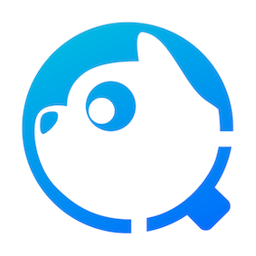

    
     
    <em>TCA, Tencent Cloud Code Analysis</em>

English | [简体中文](README_ZH.md)

## What is TCA
Tencent Cloud Code Analysis (TCA for short, code-named CodeDog inside the company early) is a code comprehensive analysis platform, which includes three components: server, web and client. It supports the integration of common code analysis tools in the industry. Its main function is to ensure the code quality under agile iterations of multiple engineering projects, and Support the team to inherit the code culture.

Code analysis is to analyze the program code through lexical analysis, grammatical analysis, control flow, data flow analysis and other technologies to verify whether the code meets standardization, safety, reliability, maintainability, partial performance, etc., and conduct a comprehensive analysis of the code A code analysis technique for indicators and metrics.

Using TCA system can help the team monitor project code quality problems, find repetitive and difficult-to-maintain code and give warnings, and at the same time open API, support the docking with upstream and downstream systems, and integrate code analysis capabilities.

## Experience
[Apply Link](https://cloud.tencent.com/apply/p/44ncv4hzp1)

## Key Features
1. **Language support**: It supports Java/C++/Objective-C/C#/JavaScript/Python/Go/PHP and more, covering common programming languages.
2. **Code inspection**: Accurately track and manage the code quality defects, code specifications, code security vulnerabilities, invalid code found through code inspection. At present, it has integrated many self-developed, well-known open source analysis tools, and adopts a layered and separated architecture, which can satisfy the team's rapid self-service management tools.
3. **Code measurement**: Support the three dimensions of code circle complexity, code repetition rate and code statistics to monitor the current code situation.
4. **DevOps integration**: The client can be started via the command line, which can quickly connect to various DevOps scheduling systems, and connect upstream and downstream systems through standard API interfaces.

## Getting Started
- [How to get start](GettingStart(TCA快速入门).pdf)
- [How to deploy server and web](doc/deploy.md)
- [How to deploy server and web with docker-compose](doc/deploy_dc.md)
- [How to use client](doc/client.md)

## Community
[Discussion](https://github.com/Tencent/CodeAnalysis/discussions)

## Changelogs
- Check our [Changelogs](doc/changelogs.md)

## Contributing
- Check out [CONTRIBUTING](CONTRIBUTING.md) to see how to develop with TCA.
- [Tencent Open Source Incentive Program](https://opensource.tencent.com/contribution) encourages the participation and contribution of developers. We look forward to your active participation.

## License
TCA is [MIT licensed](LICENSE)
