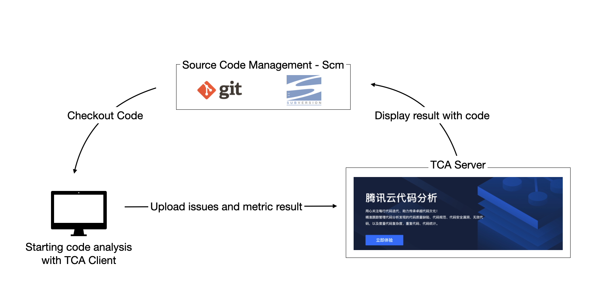

    
     
    <em>TCA, Tencent Cloud Code Analysis</em>

English | [简体中文](README_ZH.md)

## What is TCA
Tencent Cloud Code Analysis (TCA for short, code-named CodeDog inside the company early) is a comprehensive platform for code analysis and issue tracking. TCA consist of three components, server, web and client. It also supports the integration of other code analysis tools.

Code analysis is a technology, using lexical analysis, syntax analysis, control-flow analysis, data-flow analysis to make a comprehensive analysis of the code, so as to verify whether the code meets the requirements of normative, security, reliability, maintainability and other indicators.

Using TCA can help team find normative, structural, security vulnerabilities and other issues in the code, continuously monitor the quality of the project code and issue alerts. At the same time, TCA opens up APIs to support connection with upstream and downstream systems, so as to integrate code analysis capabilities, ensure code quality, and be more conducive to inheriting an excellent team code culture.

## Experience
[Apply Link](https://cloud.tencent.com/apply/p/44ncv4hzp1)

## Key Features
1. **Language support**: It supports Java/C++/Objective-C/C#/JavaScript/Python/Go/PHP and more, covering common programming languages.  
2. **Code inspection**: Discover code quality defects, code specification problems, code security vulnerabilities, invalid codes, etc. At present, many self-developed and well-known open source analysis tools have been integrated. The layered architecture can support rapid self-service management tools for teams.
3. **Code measurement**: Support comprehensive measurement of code from the three dimensions of code cyclomatic complexity, code repetition rate and code statistics.
4. **DevOps integration**: The client can be started via the command line. Standard APIs support connection to upstream and downstream systems, and various DevOps systems.

## Getting Started
- [How to get start](GettingStart(快速入门).md)
- [How to deploy server and web](doc/deploy.md)
- [How to deploy server and web with docker-compose](doc/deploy_dc.md)
- [How to use client](doc/client.md)

## Community
[Discussion](https://github.com/Tencent/CodeAnalysis/discussions)

## Changelogs
- Check our [Changelogs](doc/changelogs.md)

## Contributing
- Check out [CONTRIBUTING](CONTRIBUTING.md) to see how to develop with TCA.
- [Tencent Open Source Incentive Program](https://opensource.tencent.com/contribution) encourages the participation and contribution of developers. We look forward to your active participation.

## License
TCA is [MIT licensed](LICENSE)
