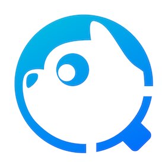

    
     
    <em>腾讯云代码分析</em>

## TCA
腾讯云代码分析（Tencent Cloud Code Analysis，简称TCA，内部曾用研发代号CodeDog）是一套代码综合分析平台，包含服务端、Web端和客户端三个组件，支持集成业界常见的代码分析工具，其主要功能是保障多工程项目敏捷迭代下的代码质量，以及支撑团队传承代码文化。

代码分析是通过词法分析、语法分析、控制流、数据流分析等技术对程序代码进行分析，验证代码是否满足规范性、安全性、可靠性、可维护性、部分性能等，对代码进行综合分析和度量等指标的一种代码分析技术。

使用TCA系统，可以帮助团队监控项目代码质量问题，发现重复和难以维护的代码并进行告警，同时开放API，支持与上下游系统对接，集成代码分析能力。

## 体验
[官方体验版](https://tca.tencent.com/)
## 关键功能
1. **语言支持**：支持 Java/C++/Objective-C/C#/JavaScript/Python/Go/PHP 等数十种语言，覆盖常用编程语言。 
2. **代码检查**：通过代码检查精准跟踪管理发现的代码质量缺陷、代码规范、代码安全漏洞、无效代码等。目前已集成众多自研、知名开源分析工具，并采用了分层分离架构，可以满足团队快速自助管理工具。
3. **代码度量**：支持代码圈复杂度、代码重复率和代码统计三个维度监控当前代码情况。
4. **DevOps集成**：客户端通过命令行启动方式，可以快速对接各个DevOps调度体系，并通过标准API接口对接上下游系统

## 快速入门
- [快速入门](GettingStart(TCA快速入门).pdf)
- [如何在本地部署Server与Web](doc/deploy.md)
- [如何通过Docker-Compose部署Server与Web](doc/deploy_dc.md)
- [如何使用客户端](doc/client.md)

## 社区
- [GitHub讨论区](https://github.com/Tencent/CodeAnalysis/discussions)

## 更新
变更内容[Changelogs](doc/changelogs.md)

## 贡献
- 查看我们的[贡献说明](CONTRIBUTING.md)
- [腾讯开源激励计划](https://opensource.tencent.com/contribution) 鼓励开发者的参与和贡献，期待你的加入

## 许可
TCA 使用 [MIT 许可证](LICENSE)