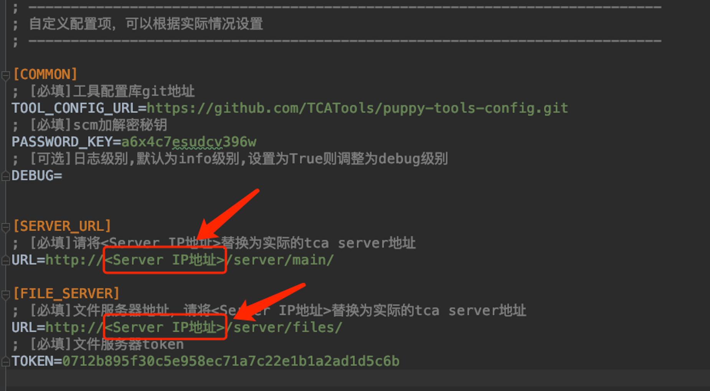
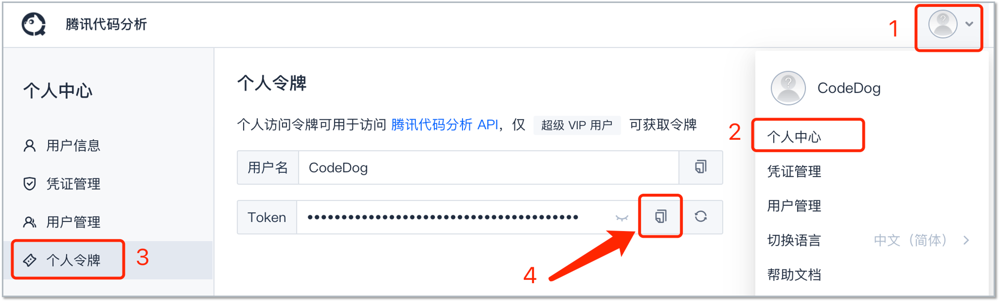
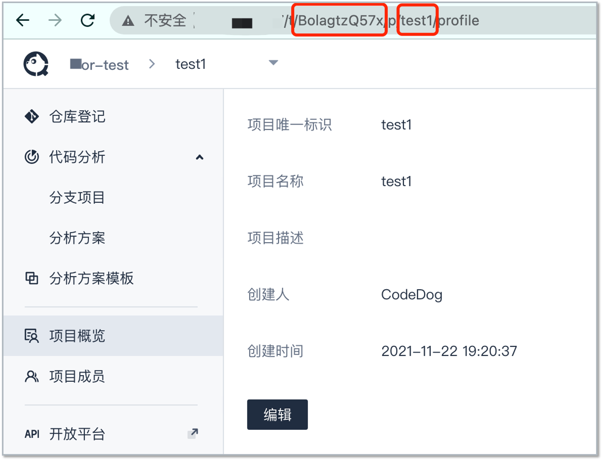

# 客户端配置与使用

## 1. 安装Python环境和第三方库
a. 预装Python3.7、pip，支持 `python3` 和 `pip3` 命令 
b. 在本地源码目录下安装依赖：`pip3 install -r client/requirements/app_reqs.pip`

## 2. 安装第三方工具
a. 进入到`client/requirements`目录
b. 在命令行中执行安装脚本`install.sh`(linux/mac环境)或`install.bat`(windows环境)

## 3. 配置client/config.ini文件
配置客户端执行环境：将`<Server IP地址>`替换成实际的serve ip（可包含端口号）。  

## 4. 配置client/codedog.ini文件，完成项目配置以启动项目扫描

### 填写以下必填项：`token`,`org_sid`,`team_name`,`source_dir`
- **token**：从web页面获取，前往[个人中心]-[个人令牌]-复制Token   

- **org_sid**：进入项目概览页，从URL中获取
- **team_name**： 进入项目概览页，从URL中获取  

> 说明：项目概览URL格式：http://{域名}/t/{org_sid}/p/{team_name}/profile  
>从中可获取到：  
>- 团队编号（org_sid）  
>- 项目名称（team_name）  

- **source_dir**：本地代码目录  
>说明：  
其他为可选参数，按需填写，默认可以不填。  
如果项目代码为编译型语言（比如：C/C++，C#，Go，Java，Kotlin，Objective-C等），且使用的分析方案中配置了编译型工具（如图，使用了OC推荐规则包），需要填写`build_cmd`编译命令。

**其他可选项按需填写，不填写时按默认配置执行**

## 5. 启动一次代码分析
进入到`client`目录下，执行命令：`python3 codepuppy.py localscan`  
注：步骤4中codedog.ini各项参数可由命令行传入，获取详细参数说明可运行`python3 codepuppy.py localscan -h`。