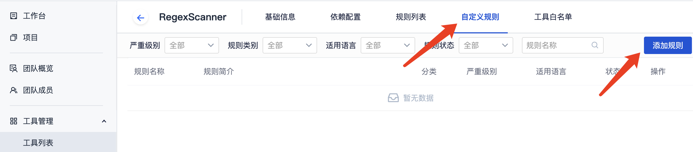

# TCA-Armory-R 使用手册

TCA独立工具TCA-Armory-R，别名RegexScanner，正则匹配工具，支持扫描文件名称和文本内容，支持页面直接**自定义创建规则**。

## 适用场景
- 检测项目中的文件名，比如漏洞文件log4j-core-2.10.1.jar
- 检测代码文件中的文本内容，比如高危函数vsscanf
- 检测配置文件中的文本内容，比如账号密码明文

## 对比RegexScan、RegexFileScan
- 单个工具即可完成文件名和文件内容的检查
- 扫描速度更快，大概减少60%的耗时
- 单条规则内支持多条正则表达式
- 支持正则过滤
- 支持匹配分组和熵检测
- *只支持[go的正则语法](https://pkg.go.dev/regexp/syntax)*

## 快速接入
以下是接入步骤：

1. 属于增强分析模块，需要先[部署CLS](../../../quickStarted/enhanceDeploy.md)
2. 在代码分析创建项目，自定义规则包里添加想要进行扫描的TCA-Armory-R规则
3. 启动分析即可

## 自定义规则
### 1. 开放支持自定义规则权限
开放**支持自定义规则**权限，需平台管理员在**管理入口**-**工具管理**中找到TCA-Armory-R工具，并将其权限状态调整为**支持自定义规则**。

规则权限详见[自定义规则权限说明](../../工具管理/自定义规则.md)
### 2. 添加规则
进入工具管理入口，进入TCA-Armory-R工具页面，选择上方的“自定义规则”，然后点击“添加规则”:

### 3. 填写规则信息
进入“创建规则”页面，按照需求填写相关信息，完成后，点击页面最后的“确定”按钮提交。

### 规则示例：
规则扫描场景：扫描代码中的 github token，如果token以明文形式写在源码文件中，会造成隐私泄露，可能造成严重的安全事故。

正则表达式：匹配 github token 字符串，根据github token的一般形式，可以推断出正则表达式 ((ghp|gho|ghu|ghs)_[0-9a-zA-Z]{36})。

::: tip
**只支持go正则语法: [regexp](https://pkg.go.dev/regexp/syntax)**
:::

建议先测试好正则表达式是否正确，正则表达式测试网站推荐：http://tool.oschina.net/regex

### 字段解释
规则名称、前端展示名称：建议使用单词首字母大写的格式，如 DetectedGithubToken

规则简述：作为扫描出来到问题标题

规则参数：

::: tip
**规则参数中的(3)(4)(5)属于新功能，需要将客户端client和工具库TCA-Armory更新到最新版本**
:::

- (1) 参数格式类似ini的格式， 也就是key = value的格式

- (2) [必选] `regex` 参数，用于指定扫描的正则表达式，例如: `regex=((ghp|gho|ghu|ghs)_[0-9a-zA-Z]{36})`。**只支持go正则语法: [regexp](https://pkg.go.dev/regexp/syntax)**。建议先测试好正则表达式是否正确，正则表达式测试网站推荐：[http://tool.oschina.net/regex](http://tool.oschina.net/regex)

- (3) [可选] `regex{N}` 参数，只有在已有`regex`参数情况下生效，用于扩展扫描的正则表达式，其中 N 从1开始计数，例如: `regex1=EAAAACZAVC6ygB[0-9A-Za-z]+`, `regex2=EAAAAZAw4[0-9A-Za-z]+`。`regex{N}`和`regex`的表达式均为**或**关系，每一个匹配结果上报一个问题。

- (4) [可选] `regex_not` 参数，用于指定正则过滤表达式，例如: `regex_not=(?i)example`。可以对(2)(3)中regex匹配的字符串进行筛选，如果匹配则过滤该结果，不予上报。

- (5) [可选] `regex_not{N}` 参数，只有在已有`regex_not`参数情况下生效，用于扩展正则过滤表达式，其中 N 从1开始计数，例如: `regex_not1=(?i)test`, `regex_not2=(?i)fake`。`regex_not{N}`和`regex_not`的表达式均为**或**关系。

- (6) [必选] `msg` 参数，用于展现issue说明， 例如: `msg=检测到高危函数%s，建议替换。`

  - msg中的“%s”使用regex中的group（用“()"括起来的部分）一一匹配，单个%s默认为整个regex匹配的字符串

  - 如果regex没有定义group，则msg最多有一个%s, 并由整个regex匹配的字符串替代

  - 如果msg里没有包含“%s”，则直接显示msg

  - 如果msg没有提供，则会给出默认信息

- (7) [可选] `ignore_comment` 参数，用于指定是否忽略注释代码，可选值：True、true、False、false 。例如: `ignore_comment=True`, 默认是False

- (8) [可选] `file_scan` 参数，用于指定是否扫描文件名称，可选值：True、true、False、false 。例如: `file_scan=True`, 默认是False

- (9) [可选] `include` 参数，用于指定只扫描的文件匹配范围，基于相对路径，使用通配符格式，多项使用英文分号（;）隔开。例如: `include=src/test;src/main.*;*.cpp`

- (10) [可选] `exclude` 参数，用于指定不扫描的文件匹配范围，格式同include参数，例如: `exclude=tests;*.json`

  > 路径过滤（`exclude`, `include`）采用Glob-Style的匹配模式，详见 [Go-filepath-Match](https://pkg.go.dev/path/filepath#Match)， 除了 `**` 用来匹配零或多个目录，本工具会**默认匹配前后目录**。举例: 
  > > 1. `exclude=*.py` 会忽略以下文件: main.py, src/main.py, main.py/install.sh
  > > 2. `exclude=tests` 会忽略以下文件: tests/test.py, a/tests/b/test.py
  > > 3. `include=main.*` 会只扫描以下文件: src/main.py, app/main.go
  > > 4. `include=src`且`exclude=src/lib` 会只扫描以下文件: src/main.py, src/project/proj.py; 忽略以下文件: src/lib/lib.py, src/lib/package/pack.js

- (11)[可选] `match_group` 参数，用于指定正则匹配的分组，数值不能大于正则匹配分组数，例如：
`regex=(aws_account_id)\s{0,50}(:|=>|=)\s{0,50}([0-9]{12})`
`match_group=3`，匹配到第3个分组`([0-9]{12})`

- (12)[可选] `entropy` 参数，用于指定正则匹配结果的最小信息熵，例如：`entropy=3`，熵不大于3的匹配结果将被过滤
  > 信息熵：[熵(信息论)](https://zh.wikipedia.org/wiki/%E7%86%B5_(%E4%BF%A1%E6%81%AF%E8%AE%BA)) 可用于敏感信息（密钥、token）的检测
  > 含义：可以理解为字符串的混乱程度，字符越随机，熵越大。因此，设置合适的熵，可以过滤掉一些误报或者人为测试用例。

### 4. 将自定义规则添加到项目分析方案中
进入 代码分析 - 分析方案 - 代码检查 - 自定义规则包 - 查看详细规则，添加规则。

