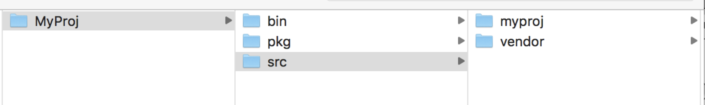

# [Golangcilint](https://github.com/golangci/golangci-lint) 使用手册

## 对比 GoMetaLinter

Golangci-lint 是为了解决 GoMetalinter 的弊端而改版升级的。

1. 比 GoMetaliner 快个 2 到 7 倍

2. 共享代码缓存，消耗内存比 Gometaliner 少 26%

3. 更精准的 issue，会内置一些 exclude 列表过滤掉误报 issue

4. 支持增量分析

## 快速接入

1. 在 CI 系统上选用 TCA 插件，或者下载 TCA 客户端到本地机器上

2. 因为 GolangCiLint 要求找寻到项目需要的全部依赖，否则就会执行失败。所以这里需要在 Ci 系统或者本地机器上配置好项目的依赖，并确保能够**编译通过**

3. 检查是否设置了 GOPATH 和 GOROOT，在分析方案的环境变量中设置 `GOPATH=$GOPATH`

4. 在 代码分析 页面上关联待分析的代码库并创建分析方案，并在代码检查-规则设置的自定义规则包里面添加 GolangCiLint 工具规则

5. 在分析方案中增加编译命令

6. 然后在 CI 系统上或者本地启动代码分析即可

## 高级配置

### Include

若项目目录结构如下图，需要设置 include 执行 myproj，比如 src/myproj/\*

这是因为 GolangCiLint 分析前会优先检查所有代码文件的依赖是否齐全，所以需要设置 include，让工具只关注 include 下面的代码文件的依赖。

在分析方案的过滤配置，路径过滤中添加 include 路径。



## Q&A

- **Q：出现 no go files to analyze 问题**

  **A：这里可能为以下原因：**

  1. 机器环境没有项目的完整依赖，使用以下命令查找对应依赖在 GOPATH 下是否存在或者 GOPATH 设置是否完整（有的项目有多个 GOPATH 内容），或者对应依赖是否存在，需要用户部署好机器环境

     ```BASH
     grep -nr "path/to/GOPATH" .
     ```

  2. 没有指定 include 分析路径过滤，这样才不会检查依赖中的依赖，而是关注源码文件的依赖完整性

  3. 也可能是某 go 文件中使用到该依赖，但是 GOPATH 没有设置正确的依赖搜索路径导致。需要找到依赖相对的当前目录：

     ```BASH
     grep -nr "path/to/GOPATH" .
     ```

     然后设置到 GOPATH 中，比如

     ```BASH
     GOPATH=$GOPATH:$SOURCE_DIR/test
     ```

  4. 还有可能是部分依赖是需要编译之后生成的，需要正确填写好编译命令，使得项目编译成功。

- **Q：could not determine GOARCH and Go compiler 问题**

  **A：跟问题 1 是一样的问题。解决方案也是一样。**

- **Q：failed to run 'go env': exit status 1 问题**

  **A：原因是找不到正确的 GOPATH。解决方案是设置 GOPATH 环境变量。**

- **Q：GO 版本限制**

  **A：因为 golangci-lint 用到了 go mod 特性，该特性是在 1.11 之后才有的。所以要求 go 版本在 1.11 版本以上。**

  
