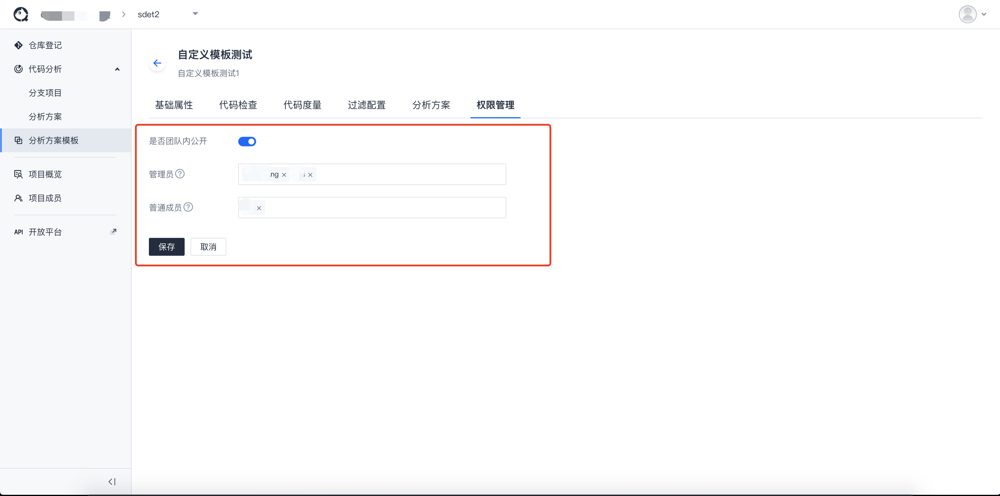

# 分析方案模版

为便于用户快速创建代码库进行分析，复用同类型的分析配置，平台提供了分析方案模板功能。

分析方案模板分为**系统方案模板**和**个人自定义方案模板**。

- **系统方案模板**

  **全局可用**。但是用户无法变更系统方案模板内容。如系统方案模板产生变更，需用户自行拉取最新模板内容。

  

- **个人自定义方案模板**

  自定义方案模板与团队挂钩，用户可自行创建、更新、同步方案模板，以及可进行权限控制。默认自定义方案模板团队内都可见。

  

分析方案模版用于在创建分析方案时作为模版参考。分析方案模版全局可用，不用和某个代码库关联。

## 使用说明

- 创建分析项目时，可选择使用分析方案模板创建。默认会根据该分析方案模板创建出一个新的分析方案，并用该方案配置进行分析项目创建。

- 创建分析方案时，可选择使用分析方案模板创建。

- 用模版生成的分析方案和模版建立关联关系，当模版和生成的方案由差异时，可以由用户选择是否同步模版的内容到方案。并可以选择拉群哪些功能模块的配置。
