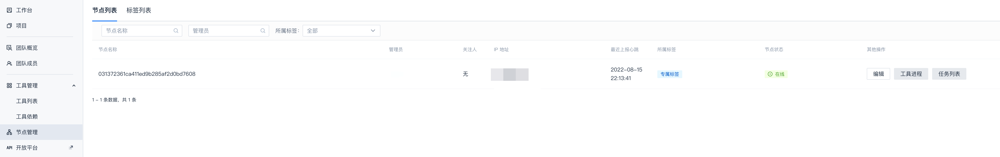
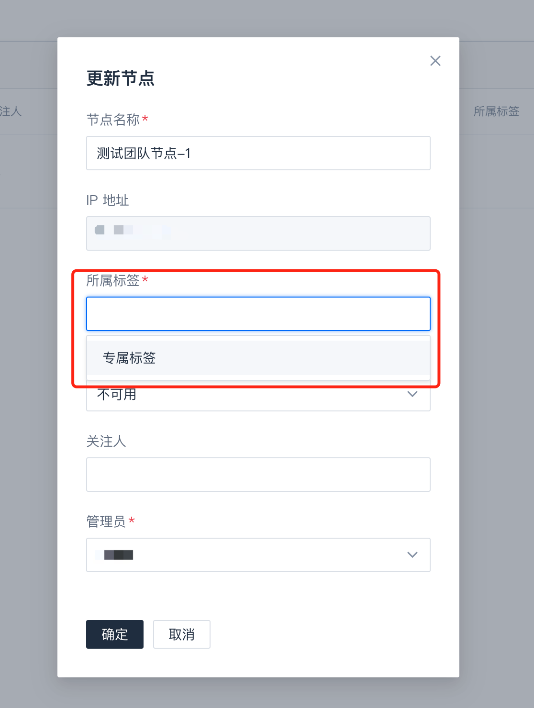

# 团队节点与标签

::: warning
**团队节点及标签说明**

- **团队节点**是团队注册并管理的私有节点。

- **团队标签**用于关联团队内的节点机器与分析项目。

- 团队可以利用**团队标签**注册并使用**团队节点**。

- 在项目的分析方案中配置运行环境为团队标签后，才可将该项目的分析任务下发到对应的团队节点。

- 团队节点**仅支持运行**当前团队中的分析任务，节点可执行的任务范围取决于该节点的负责人权限：
  - 如果节点负责人为团队管理员，该节点可以执行当前团队所有项目的分析任务
  - 如果节点负责人为项目管理员，该节点只能运行指定项目下的分析任务
  - 如果节点负责人为部分代码库的管理员，该节点只能运行对应代码库的分析任务
:::

## 适用场景

1. 团队因资源可靠性或项目敏感性，需使用私有机器资源

2. 团队项目分析依赖**特定机器环境**（比如CPU架构、操作系统等）

以上场景，团队可接入专机资源作为团队节点，仅分析自己业务的代码库，以**保证执行效率**，**保护源码安全**，**支持项目环境依赖**等。

## 团队节点注册

参考[客户端常驻节点分析](../客户端/常驻节点分析.md)进行环境配置和启动节点。

## 团队节点管理

完成团队节点注册后，可以在当前团队`节点管理`下看到对应的节点信息，同时**需要进行节点配置**

::: warning
- 团队节点**首次注册**时，需要手动在平台上配置**所属标签**、**节点可用性**、**工具进程**等。
- 将节点的**节点可用性**调整为**活跃**后，节点终端客户端运行日志会输出**心跳上报成功**的日志
:::

- 首次注册团队节点，节点状态默认为不可用，需调整节点状态为“活跃”：
  

- 配置节点关联的工具进程：
  
  

::: tip
1. 团队节点使用的**所属标签**均为当前团队内创建的标签，可参见[团队标签管理](#团队标签管理)
2. 团队标签可以参考`CodeDog`标签为不同的系统类型（Linux、MacOS、Windows）建立标签，比如`专属标签-Linux`、`专属标签-Mac`等
:::

## 使用团队标签

您可以创建一个团队标签，并配置到您的团队节点和您的分析方案中

- 创建团队标签。

  

- 配置团队节点所属标签。
  
  

- 配置分析方案运行环境。

  

