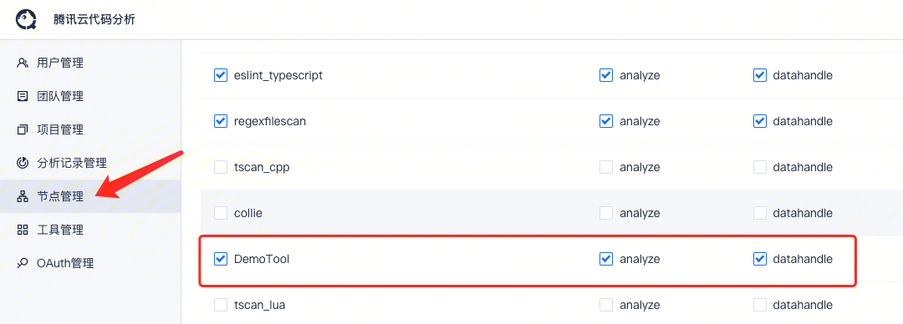

# 自定义工具

腾讯云代码分析平台支持用户自助添加代码分析工具。

适用场景：自定义规则无法满足团队业务复杂需求，需要更多的代码逻辑来匹配目标代码的情况。通常需要团队业务方自行实现对应代码分析工具。

只需要几步操作：

1. 编写代码，实现扫描工具逻辑
2. 提交工具到 git 代码库
3. 在页面创建新工具
4. 为工具添加规则
5. 将工具配置到执行节点
6. 在项目分析方案中添加规则

::: danger 扩展集成工具免责声明
被扩展集成进腾讯云代码分析系统的任何非官方工具，该类工具对于腾讯云代码分析系统等于黑盒，腾讯云代码分析系统不对该类工具负责，由该类工具方承担所有责任（包括但不限于分发被分析代码，产生代码以及相关信息泄漏）。
:::

## 自定义工具步骤说明

### 第一步，编写代码，实现分析工具逻辑

根据需要匹配的目标代码场景，编写对应的工具逻辑。
可以参考 Python 实现的 [Demo 项目](https://github.com/TCATools/demo_tool)。

**必要：**

- **运行方式**：支持命令行执行，比如 python run.py 或 run.exe，执行命令的工作目录为工具代码的根目录。

- **运行环境说明**： 
  - 建议将工具打包编译成可执行程序，拉取下来直接可以执行。
  - 如果工具需要在特定的环境中运行，比如python、java环境，平台提供了丰富的工具依赖包，可以在`工具管理`-`工具依赖`中查看，创建工具时可供选择，执行时会自动配置好依赖环境。
  - 如果现有的工具依赖包未支持所需依赖，也可以创建新的工具依赖使用。

- **平台已提供的环境变量**

  - 获取及使用方式请参考 [Demo 项目](https://github.com/TCATools/demo_tool)。
  ```
  SOURCE_DIR：要扫描的代码目录路径
  DIFF_FILES: 值为一个json文件路径，文件内容为增量扫描的文件列表(增量扫描时可用)
  SCAN_FILES: 值为一个json文件路径，文件内容为需要扫描的文件列表(增量或全量扫描均可用)
  TASK_REQUEST: 值为一个json文件路径，文件内容为当前扫描任务参数
  RESULT_DIR: 结果result.json输出的结果目录路径
  ```
  
- **工具命令声明**
 
  在工具仓库根目录下，添加一个`tool.json`文件，声明工具的检查和扫描命令，比如：
  ```json
  {
    "check_cmd": "python src/main.py check",
    "run_cmd": "python src/main.py scan"
  }
  ```
  参数说明：
  - `check_cmd`：
     - 功能：判断当前执行环境是否满足工具要求（如果不需要检查，也可以没有这个命令）。
      比如某些工具只能在linux下执行，需要判断当前是否为linux环境。
     - 输出：将判断结果输出到`check_result.json`文件中，文件内容为`{"usable": true}`或`{"usable": false}`。
  - `run_cmd`：
    - 功能：扫描代码，执行自定义检查器逻辑（该命令必须存在）。
    - 输出：按照指定格式，输出结果到结果目录下的`result.json`文件中。
    
- **工具输出格式要求**

  - 将扫描结果输出到`RESULT_DIR`环境变量指定的目录下的`result.json`文件中（Python 示例代码）
  ```python
  import os
  import json
  result_dir = os.getenv("RESULT_DIR", os.getcwd())
  result_path = os.path.join(result_dir, "result.json")
  with open(result_path, "w") as fp:
      json.dump(result, fp, indent=2)
  ```

  - `result.json` 文件格式如下：
  ```json
  [
      {
          "path": "文件绝对路径",
          "line": "行号，int类型",
          "column": "列号, int类型，如果工具没有输出列号信息，可以用0代替",
          "msg": "提示信息",
          "rule": "规则名称,可以根据需要输出不同的规则名",
          "refs": [
              {
                  "line": "回溯行号",
                  "msg": "提示信息",
                  "tag": "用一个词简要标记该行信息，比如uninit_member,member_decl等，如果没有也可以都写成一样的",
                  "path": "回溯行所在文件绝对路径"
              },
              ...
          ]
      },
      ...
  ]
  ```

  **`refs`** 字段说明：

  非必需项，可无。该字段记录问题回溯路径信息。比如当前行的代码问题，是经过上下文的三行代码执行路径而导致的，可以将这三行的位置及提示信息，按顺序添加到 refs 数组中。

### 第二步，提交工具到 git 代码库

- 创建代码库，将工具源代码或编译打包后的可执行文件，提交到代码仓库中（建议提交到master分支，TCA默认拉取的是master分支）。

- 建议代码库中加入 README.md 文件，说明工具功能和维护人。

- 后续需要修改工具实现逻辑，可以直接更新代码库，TCA 平台在执行该工具时，会自动拉取最新工具代码版本。

### 第三步，在工具管理页面中创建工具

- 进入工具管理页面，点击创建工具

  

- 填写工具信息

  

  **部分参数说明：**

  - **工具仓库地址**，即前述步骤中提交的工具 git 代码库地址，默认拉取的是master分支，如果是其他分支，需要在仓库地址后加上`#分支名`，比如：`https://github.com/xxx/xxx.git#main`

  - **工具认证**，授权拉取工具仓库的权限

  - **执行命令**，该命令会在工具根目录下执行

  - **环境变量**，工具执行所需的环境变量

  - **License**，如果是开源工具，填写工具遵循的开源协议，或者填写自研共建

  - **是否为编译型工具**，表示在使用该工具对用户代码进行分析时，是否要求代码需要编译或可执行编译

  - **注意**：针对特殊扫描场景的工具（比如检查代码库下是否包含某些第三方依赖目录，结果不涉及单个代码文件的），无法对结果进行代码文件处理，可以通过设置以下环境变量，跳过一些通用的结果处理步骤，避免问题结果被过滤掉：
    - `BLAME_TYPE=NO_BLAME`，跳过对代码行/代码文件进行文件责任人定位（结果非单个文件/代码行时使用）
    - `FILTER_TYPE=NO_VERSION_FILTER`，跳过检查问题路径（path字段）是否为已提交到代码库中的文件（结果非单个文件/代码行时使用）
    - `IGNORE_TYPE=NO_ISSUE_IGNORE`，跳过注释忽略处理（结果非单个文件/代码行时使用）

-  添加工具依赖

   

   添加完成后，会展示已添加的依赖方案：
  
   

**工具依赖说明：**
- 比如当前的demo工具，只需要依赖python3运行，而且支持在linux x86_64、linux arm64、mac和windows下执行，那么只需要配置一个依赖方案（如上图），并配置为默认方案。在不同的操作系统中，会自动加载对应操作系统的python环境。
- 如果需要根据扫描项目设置的环境变量，加载不同的依赖配置，则可以配置不同的判断条件，使用多个依赖方案。


### 第四步，为工具添加规则

- 完成工具创建后，进入规则列表，为工具添加规则

  

- 填写规则信息

  **部分参数说明：**

  - **规则简介**：简要描述规则发现的是什么问题，扫描结果中会作为问题标题展示

  - **详细描述**：可详细描述规则，以及规则的解决方式，建议附上解决案例 demo

  - **解决方法**：按照实际情况，说明该代码问题的解决方法，建议附上解决案例 demo

  - **规则参数**：如果不需要通过规则参数传递信息，可留空

### 第五步，将工具配置到执行节点

::: tip
需要联系平台管理员协助操作，在`管理入口`-`节点管理`中进入需要配置的机器节点的`工具进程配置`中，找到对应工具，勾选工具进程。

完成节点配置工具进程后，才能在项目中采用该工具进行分析。
:::



### 第六步，完成上述操作，在项目中使用工具规则

- 进入到项目中，在`分析方案`-`代码检查`进行规则配置。

- 点击添加规则，找到对应工具规则进行添加。

- 添加完成后，启动分析，为了将规则应用到所有代码文件，建议启动一次全量分析（增量分析只会分析自上次扫描后变更的文件）。

## 自定义工具权限说明

- **默认自定义工具仅团队管理员可操作，团队内所有成员可使用。**

  - 团队管理员才能创建工具，添加工具规则等，具备该工具全部权限

  - 团队内所有成员可使用该工具规则，如在规则配置中添加此工具规则，团队普通成员仅只读权限

- **工具希望全平台使用？**

  由于全平台使用的工具影响范围较大，建议团队先在团队内对工具进行充分测试，保障团队内工具的高有效性，如需全平台使用，需联系平台管理员进行申请

  平台管理员需对此工具进行审核，在确保工具的高有效性下可将此工具权限调整为全平台可使用
