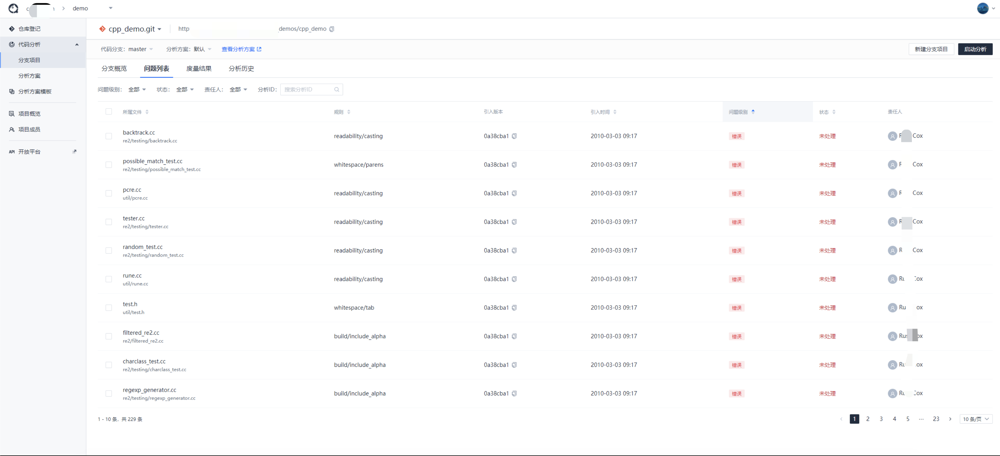
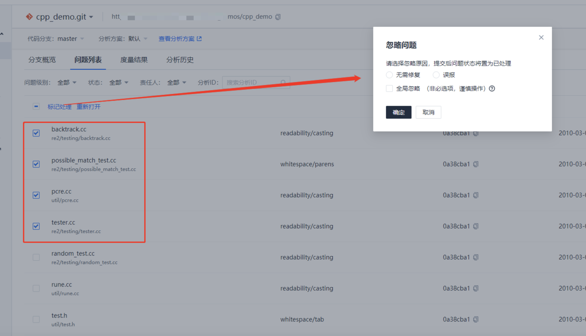

# 代码检查结果查看

代码分析完毕后，可在`分支概览`页面查看分析结果概览。如果分析方案含有代码检查功能，则会上报代码检查结果信息到腾讯云代码分析平台，用户可在平台上查看问题列表及问题详情。

## 问题列表

进入代码检查问题列表页面后，默认展示当前分析项目发现的全部未处理问题。

如果仅希望查看增量问题，可以进入`分析历史`页面，指定查看某一次的扫描结果即可。也可以在过滤筛选项中填入发现问题的扫描 `id`进行筛选查看结果（该`id`为扫描任务 ID，需要到扫描任务列表中查询）。

- **责任人说明**

  责任人为 `git blame`操作得到的代码提交人。

- **问题级别说明**

  代码检查的问题级别是根据对应分析方案中规则设置的严重级别定义的，从高到低分为 **`致命、错误、警告、提示`** 。如果调整问题级别，则需要进入分析方案中调整这个规则的严重级别，调整后需要进行全量扫描使得调整生效。

- **批量处理说明**

  问题列表支持批量修改问题状态。

  

## 问题详情

点击规则信息可以查看规则说明。

