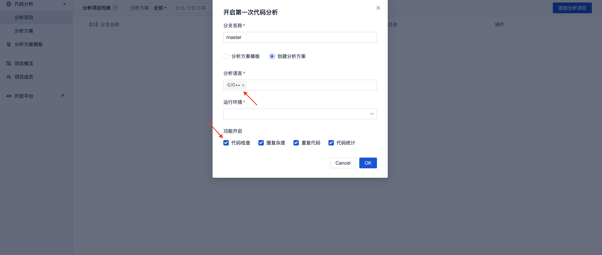
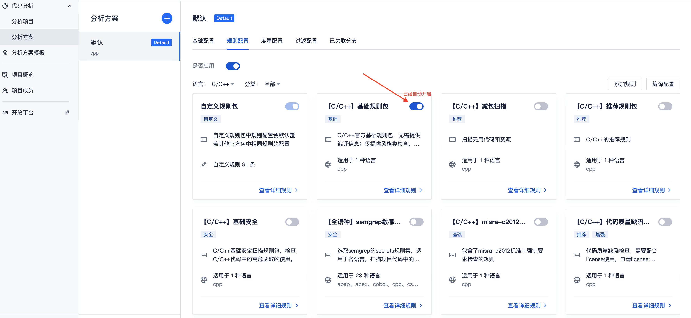
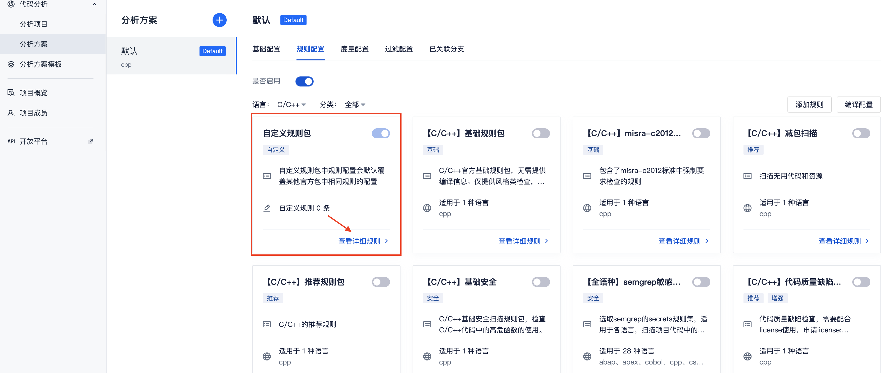
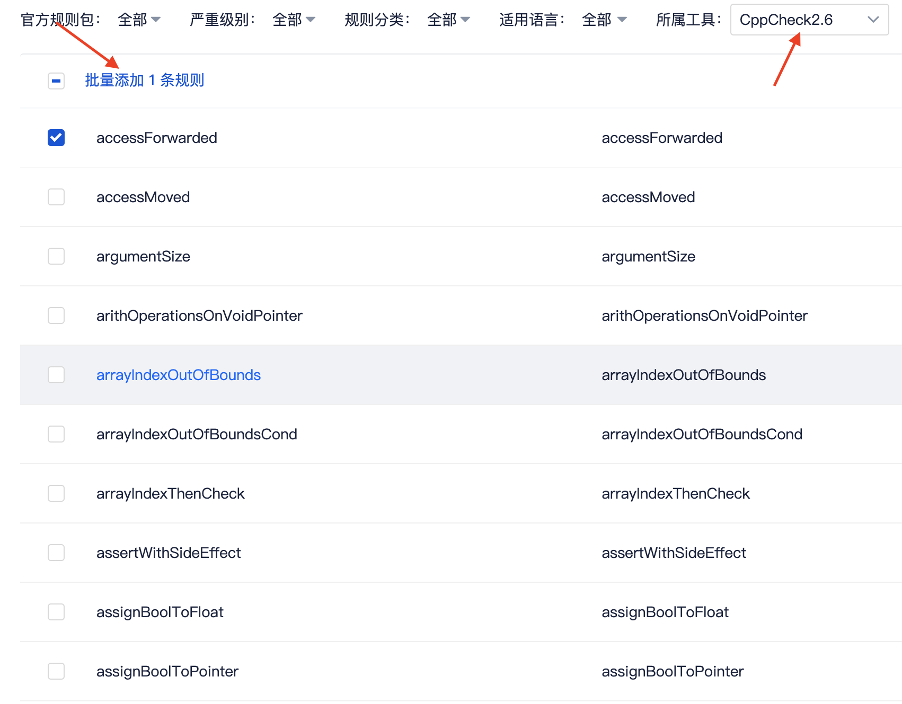
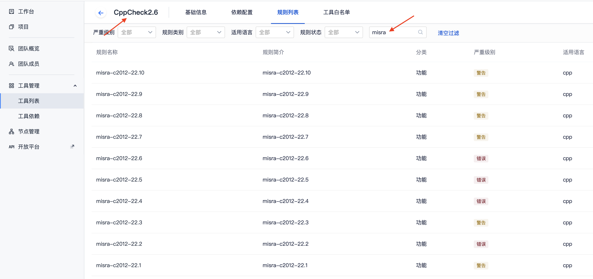
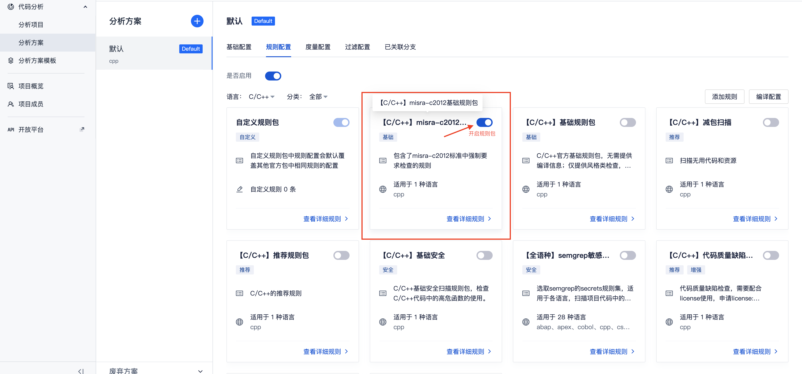

# cppcheck与misra 使用手册

## cppcheck 介绍

> cppcheck是一个静态代码检测工具，用于对c/c++编写的代码进行严格的逻辑检查，从而让开发人员及时发现潜在问题

### cppcheck检查类别:
- 自动变量检查
- 数组边界检查
- class类检查
- 内存泄漏检查
- 内存的使用与释放检查
- 异常STL 函数使用检查
- 废弃,过期函数的调用检查
- 代码格式错误，以及性能因素检查
- 操作系统资源释放检查，中断，文件描述符等   
...

## TCA cppcheck工具版本说明

**目前TCA支持两个版本的cppcheck工具:**

- `cppcheck`工具 对应 `1.78`版本    
- `cppcheck2.6`工具 对应 `2.6`版本   

**两个版本的工具所支持的规则数量如下:**

- `cppcheck` 目前包含 `257` 条检查规则
- `cppcheck2.6` 目前包含 `466` 条检查规则(其中包含misra检查规则`157`条)

## TCA cppcheck2.6工具新增特性
**相比老版本`cppcheck`工具的变化:**   

**1，新增了一批检查规则，比如：**
- `missingReturn`: 函数缺少return检查
- `incompatibleFileOpen`: 文件在不同流中被同时进行读写访问
- ...
- more: 更多新增的规则特性可以访问cppcheck项目的[release页面](https://github.com/danmar/cppcheck/releases)了解

**2，支持了misra-c2012检查规则(适用于嵌入式项目的代码检查):**
> Q: `misra`是什么?    
> A: `misra` 是由汽车产业软件可靠性协会提出的 `C/C++` 语言开发标准，目的是为了增进嵌入式系统的安全性，最早期的`misra-c1998`只针对汽车制造业的嵌入式开发,到现在的`misra-c2012`已经扩大覆盖范围到更对的嵌入式开发领域中

目前`misra-c2012`的所有检查规则都已经集成到`cppcheck2.6`工具中

## 快速接入使用

### (1)使用系统推荐的C/C++规则包体验cppcheck工具的检查规则:

**step1:** 登记好代码仓库之后, 在【分析项目】页面中会自动提示开启第一次代码分析, 选择分析语言为 `C/C++`, 勾选`代码检查`功能, 如下图所示：

**step2:** 创建完成后可以在分析方案的【规则配置】中看到`【C/C++】基础规则包`自动开启，其中包含了部分系统推荐的cppcheck的检查规则, 如下图所示:

**step3:** 选择刚刚创建的分析项目，直接启动分析即可

### (2)使用自定义规则包配置自己所需的cppcheck检查规则：

**step1:** 创建【分析方案】，然后在 【规则配置】tab下，可以看到【自定义规则包】，点击`查看详细规则`, 如下图所示:

**step2:** 在页面右上角点击 `添加规则`按钮，跳转到添加规则页面，所属工具选择`cppcheck` 或者 `cppcheck2.6`，按需添加列表中所需的规则即可, 如下图所示:

**step3:** 最后创建【分析项目】，直接选用此分析方案启动分析即可

### (3)使用misra检查规则: 
`misra-c2012`规则目前包含在 `cppcheck2.6` 工具中，可在工具的规则列表中搜索 `misra` 关键字，查看到所有的misra检查规则，如下图所示:

**使用方案一:** 按照上述使用[`自定义规则`的方式](#2使用自定义规则包配置自己所需的cppcheck检查规则)添加所需的misra检查规则即可,此处不再赘述

**使用方案二:** 使用系统推荐的misra规则包，里面包含了`misra-c2012`强制要求的所有规则，可以直接在 【分析方案】-> 【规则配置】中开启即可, 如下图所示:

