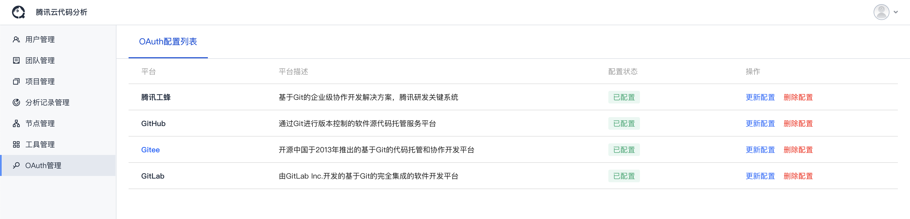

# OAuth管理

- 可**创建**、**编辑**、**清除**主流代码托管平台的Oauth应用配置，为使用者提供OAuth授权支持。

- 支持平台及如何创建OAuth应用：

    - 腾讯工蜂：[创建 OAuth 应用程序](https://code.tencent.com/help/oauth2/)
    - GitHub：[创建 OAuth 应用程序](https://docs.github.com/cn/developers/apps/building-oauth-apps/creating-an-oauth-app)
    - Gitee：[创建 OAuth 应用程序](https://gitee.com/api/v5/oauth_doc#/list-item-3)
    - GitLab：[创建 OAuth 应用程序](https://docs.gitlab.com/ee/integration/oauth_provider.html)

::: tip
配置OAuth应用时，回调地址栏需填入当前TCA平台配置的域名或IP地址（如当前页面非80端口，需要显式指定端口号），作为Git平台上OAuth应用的回调地址。
:::

## Gitlab使用步骤

> 需要设置 --env GITLAB_OAUTH_URL=http://host/oauth/authorize --env GITLAB_URL=http://host --env HTTPS_CLONE_FLAG=false
> 
> docker启动的时候增加--env  其它方式启动类似设置环境变量
> 
> HTTPS_CLONE_FLAG=false 参数TCA默认设置true，如果需要开启http而非https，则需要设置此参数

### 第一步：创建Application
* 私有化部署Gitlab Preferences找到Application
* 创建Application，选择授权scope，只需要api权限
* 填入Callback URL，此URL在TCA超级管理员页面复制`http://host/cb_git_auth/tgitsaas`
* 保存，并且复制 ApplicationID（clientId） Secret

## 第二步：设置TCA OAuth配置
* 如上Gitlab设置的图片，填入即可

## 第三步：完成授权
* TCA凭证管理，点击授权按钮，会弹出对应的授权页，授权完成即可
