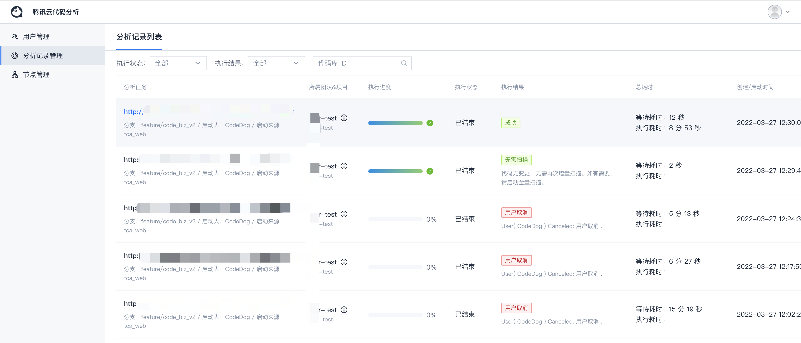
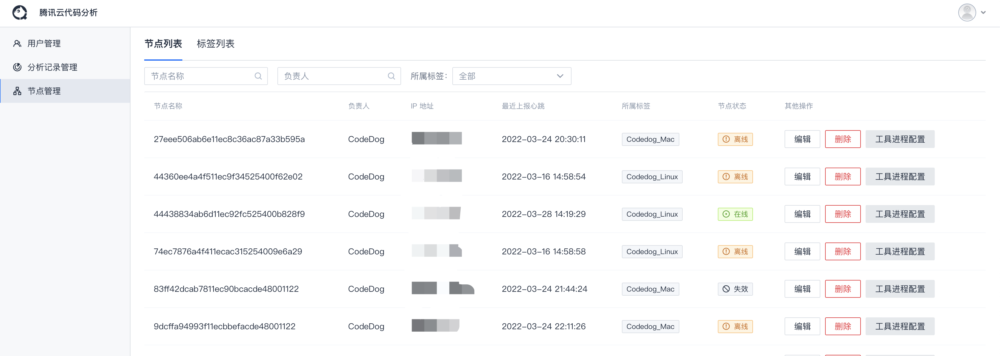

# 后台管理说明

仅**超级管理员**可进入后台管理页面

包含以下管理页面：`用户管理`、`分析记录管理`、`节点管理`、`工具管理`

## 用户管理

- 可**查看**、**编辑**、**创建**平台用户。

- 可配置用户的**登录密码**、**用户级别**、**超级管理员**等。

## 分析记录管理

- 可查看平台**全部分析记录**。

- 可点击查阅**分析记录详情**。

## 节点管理

- 可查看**常驻节点状态**。

- 可**查看**、**编辑**、**删除**常驻节点。

- 可配置节点**工具进程**。

- 可配置**标签**

## 工具管理

- 可查看**全部工具**（包含平台提供工具、团队自定义工具）。

- 可**查看**、**编辑**工具。

- 可变更工具**权限状态**。

::: tip
工具的权限状态仅能由**平台管理员**进行变更调整，需谨慎调整

- **团队内可用**：即工具配置了可用团队白名单的团队可以使用该工具，默认创建工具的团队已在白名单内

- **全平台可用**：即不同团队都可见可用该工具

- **支持自定义规则，全平台可用**：即该工具不同团队都可见可用，且支持用户添加团队所需的自定义规则，该自定义规则存在团队隔离，仅团队内可以，其他团队不可使用
:::

## OAuth管理

- 可**创建**、**编辑**、**清除**主流代码托管平台的Oauth应用配置，为使用者提供OAuth授权支持。

- 支持平台及如何创建OAuth应用：

    - 腾讯工蜂：[创建 OAuth 应用程序](https://code.tencent.com/help/oauth2/)
    - GitHub：[创建 OAuth 应用程序](https://docs.github.com/cn/developers/apps/building-oauth-apps/creating-an-oauth-app)
    - Gitee：[创建 OAuth 应用程序](https://gitee.com/api/v5/oauth_doc#/list-item-3)
    - GitLab：[创建 OAuth 应用程序](https://docs.gitlab.com/ee/integration/oauth_provider.html)

::: tip
配置OAuth应用时，回调地址栏需填入当前TCA平台配置的域名或IP地址（如当前页面非80端口，需要显式指定端口号），作为Git平台上OAuth应用的回调地址。
:::
