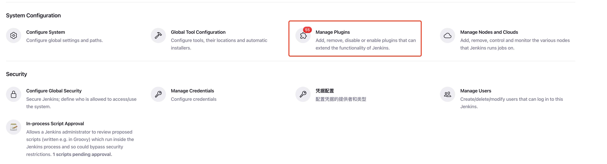
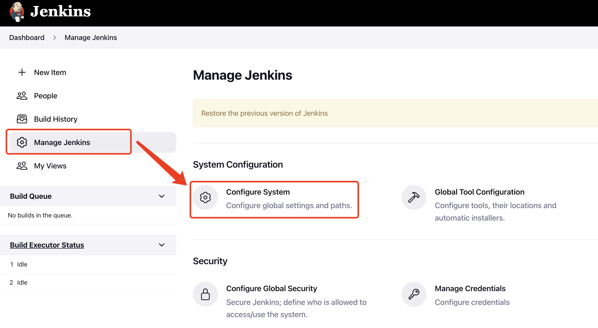
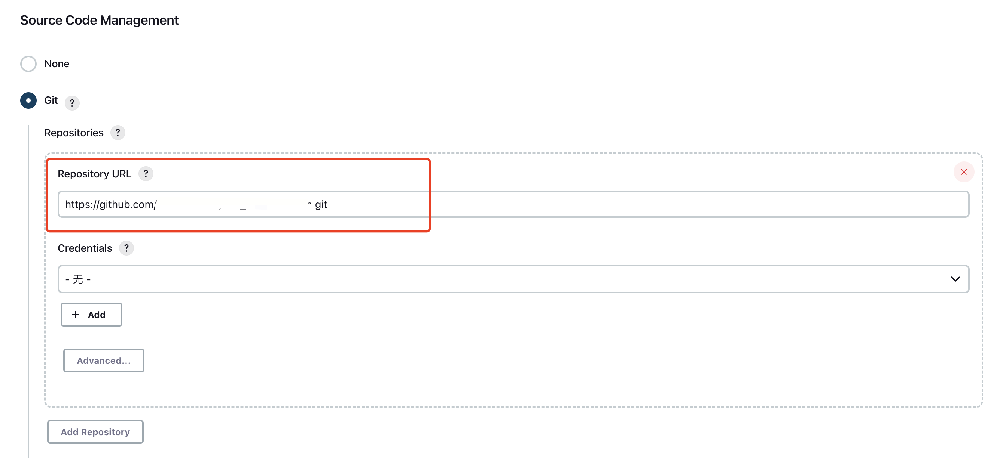
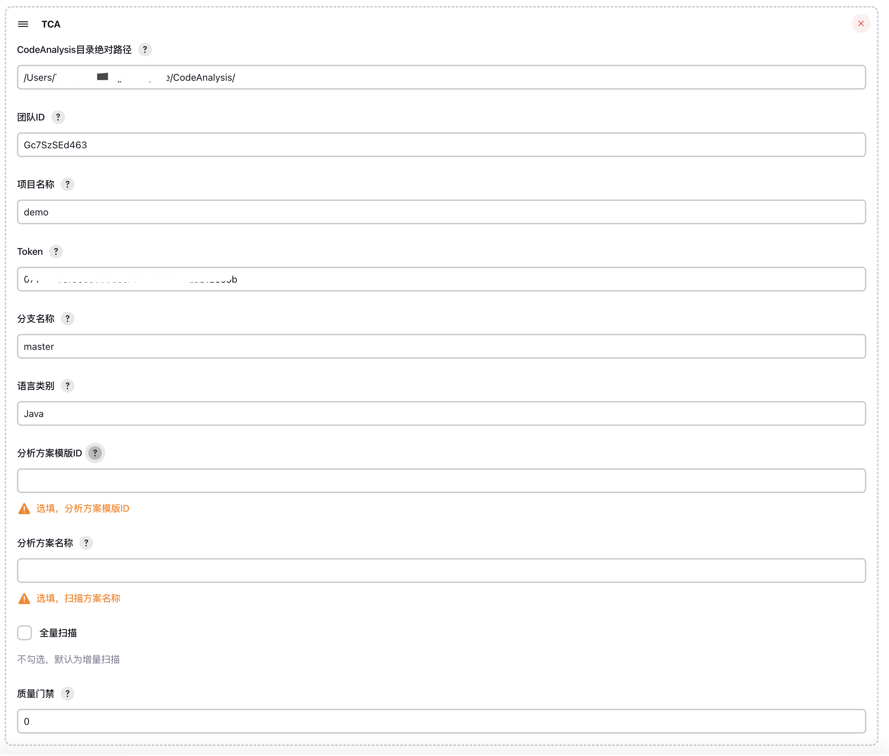
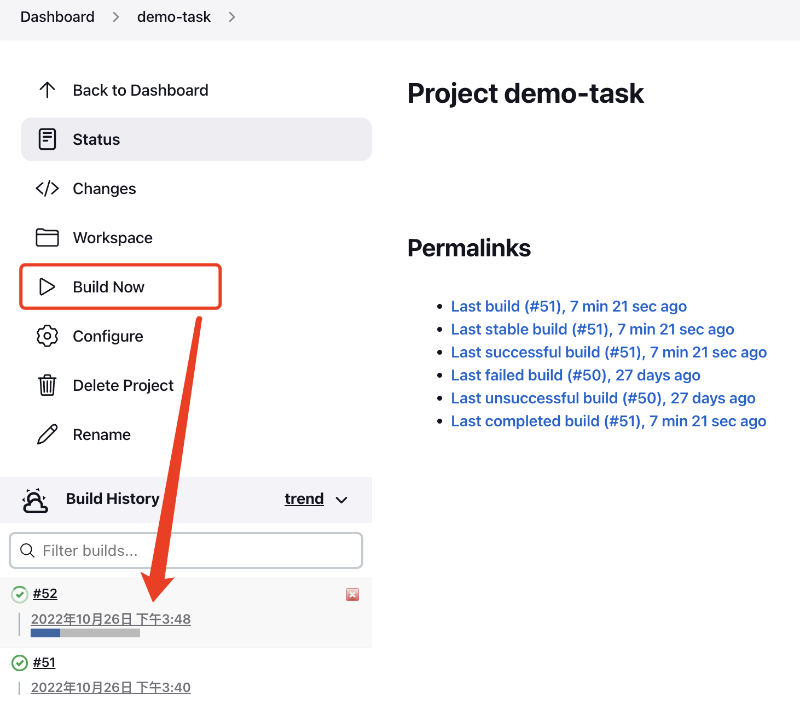

# Jenkins插件使用说明
::: tip
以下说明以 Jenkins 2.361.2 版本为例。
:::

## 使用前准备
### 获取Jenkins插件
Jenkins插件有以下两种获取方式：

**方式一**：在 TCA 源码的`plugin/jenkins_plugin`目录下，执行命令`mvn package -DskipTests`，打包完成后进入target目录会看到`tca_jenkins_plugin.hpi` 的安装包。

**方式二**：从TCA release 安装包中，获取`jenkins_plugin.hpi`：[https://github.com/Tencent/CodeAnalysis/releases](https://github.com/Tencent/CodeAnalysis/releases)。

### 在Jenkins安装插件
在Jenkins中通过【Manage Plugin】-> 【Advanced】->【Deploy plugin】的方式选择 Jenkins_plugin.hpi文件上传安装，并重启Jenkins。  



最终在【Installed】里搜索出【TCA】代表插件安装成功。


### 完善启动客户端的环境
在CodeAnalysis目录下执行代码
```shell
bash ./scripts/base/install_bin.sh
```
将`client`目录下的`config.ini`文件中的`<Server IP地址>`替换为部署的开源版TCA的IP地址（可包含端口号）

## 使用插件
### 在 TCA 创建团队和项目
如已创建后待使用的团队和项目，可跳过此步。

进入已部署好的TCA页面，点击【创建团队】，成功后【创建项目】。

### 配置Jenkins环境变量
进入Jenkins设置界面，在【Manage Jenkins】->【Configure System】->【Global properties】中添加环境变量：  
Name：`PYTHONPATH`      Value：xxxx（路径不包含python3）  
Value：`GITPATH`        Value：xxxx（路径不包含git）  




### 配置 TCA 插件
#### 方式一：可视化界面配置 TCA 插件
创建一个构建任务，配置代码库信息，进入Jenkins，通过【New Item】创建一个空白任务，在任务配置中【Source Code Management】配置待分析的代码库地址和凭证。  
`Repository URL`: 填入远端仓库地址  
`Credentials`: 添加仓库的用户名和密码作为凭证，如果是公开仓库，可以不设置仓库凭证




在构建任务的【Build】中选择【TCA】插件并配置以下参数： 

`CodeAnalysis目录绝对路径`: 拉取到本地的CodeAnalysis开源仓库目录的绝对路径(例如：/data/CodeAnalysis/)  
`团队ID`: 在 TCA 中创建的团队的标识ID，可在TCA【团队概览】中获取“团队唯一标识”  
`项目名称`: 在 TCA 中创建的项目的标识ID，可在TCA【项目概览】中获取“项目唯一标识”  
`Token`: 在 TCA 的【个人中心】->【个人令牌】中获取  
`分支名称`: 需要扫描的代码分支名称  
`语言类别`: 项目需要扫描的语言  
`分析方案模板ID`: 需要使用的分析方案模板ID，在分析方案模板的“基础属性”中获取，将根据此模板创建分析方案（选填）  
`分析方案名称`: 指定创建出来的分析方案的名称（选填）  
`全量扫描`: 不勾选默认启动增量扫描   
`质量门禁`: 设置质量门禁值，配置和使用参考 [设置质量门禁](#设置质量门禁)

配置完成后点击【Save】保存。



#### 方式二：pipeline语法配置 TCA 插件
在步骤中添加TCA插件参数配置语句，下面的配置语句可作为参考；注意：如果是release版本v1.11.0及之前的老版本（包含源代码构建生成和release获取）插件，语法参数略有差别，请参考[issue1150](https://github.com/Tencent/CodeAnalysis/issues/1150)

```pipeline
pipeline{
  agent any

    stages{
      stage('Build'){
        steps{
            TCA(codeAnalysisPath: '/data/CodeAnalysis/', teamId: 'xxxx', projectName: 'demo', token: 'xxxxxxxxxxxx', branchName: 'master', languageType: 'Java', refSchemeID: '1', scanPlan: 'model', threshold: '90', total:true)
        }
      }
    }
}

```
`codeAnalysisPath`: 拉取到本地的CodeAnalysis开源仓库目录的绝对路径(例如：/data/CodeAnalysis/)  
`teamId`：团队ID  
`projectName`: 项目名称  
`token`: 在 TCA 的【个人中心】->【个人令牌】中获取  
`branchName`: 需要扫描的代码分支名称  
`languageType`: 项目需要扫描的语言  
`refSchemeID`: 需要使用的分析方案模板ID，在分析方案模板的“基础属性”中获取，将根据此模板创建分析方案（选填）  
`scanPlan`: 指定创建出来的分析方案的名称（选填）  
`threshold`: 设置质量门禁值  
`total`: 是否全量扫描，填`ture`为全量扫描，不填或填`false`为增量扫描  

### 启动构建并查看结果
点击【Build Now】启动构建。  
进入构建任务，在【Console Output】中查看执行过程。  
执行完成后，可在下方看到代码分析的结果链接，也可在【代码分析报告】中获取代码分析的json报告。  



## 设置质量门禁
在上述 TCA 插件配置部分填写`质量门禁`参数，需要填写一个整数，即当前分支的扫描问题量大于该质量门禁值时，判断为不通过；否则为通过。完成后会将TCA结果状态（`success`|`failure`）输出到工作空间下的`tca_threshold.txt`文件中，供后续步骤判断和终止流水线。

### 可视化界面使用质量门禁

在TCA插件后增加shell命令步骤，输入以下脚本内容：


```shell
tca_status=`cat tca_threshold.txt`
if [ "${tca_status}" == "success" ]; then
  echo ">> tca scan pass!"
else
  echo ">> tca scan fail! exit code 255"
  exit 255
fi
```
当质量门禁不通过时，会终止流水线（退出码：255）。

### pipeline脚本使用质量门禁
以下是pipeline脚本使用质量门禁进行相应操作的示例，你可以在if和else部分写入你想要运行的脚本

```pipeline
pipeline{
  agent any

    stages{
      stage('Build'){
        steps{
            TCA(codeAnalysisPath: '/data/CodeAnalysis/', teamId: 'xxxx', projectName: 'demo', token: 'xxxxxxxxxxxx', branchName: 'master', languageType: 'Java', refSchemeID: '1', scanPlan: 'model', threshold: '90', total:true)
            script{
                def tca_status = readFile('tca_threshold.txt')
                if (tca_status == "success") {
                    echo ">> tca scan pass!"
                } else {
                    echo ">> tca scan fail! exit code 255"
                    error("TCA scan failed. Terminating pipeline.")
                }
            }
        }
      }
    }
}
```
