# 私有化gitlab Oauth认证

## 一、操作步骤
### 1、 本地gitlab 生成 application
#### （1）进入Preferences模块
#### （2）选择Application模块
#### （3）添加新的application
#### （4）填写name、Redirect url并勾选可用权限
#### （5）保存application

### 2、在项目配置文件中添加相关配置信息
以下三种部署方式选择其中一项即可。
#### （1）docker-compose 部署方式
找到server/dockerconfs/ 目录下的 .env.local 文件，添加配置信息。
```bash
#Oauth认证相关配置
GITLAB_OAUTH_URL="http://<部署gitlab的ip地址>:<gitlab 端口号>/oauth/authorize/"
GITLAB_URL="http://<部署gitlab的ip地址>:<gitlab 端口号>/"
```
在项目根目录下执行更新部署操作
```bash
bash ./quick_install.sh docker-compose stop  #停止运行中的TCA容器
bash ./quick_install.sh docker-compose deploy  #重新部署TCA相关容器与初始化（或刷新数据）
```

#### （2）docker 部署方式
在/.docker_temp/configs/config.sh 中添加以下配置 （首次部署无该文件夹）
```bash
#Oauth认证相关配置
export GITLAB_OAUTH_URL="http://<部署gitlab的ip地址>:<gitlab 端口号>/oauth/authorize/"
export GITLAB_URL="http://<部署gitlab的ip地址>:<gitlab 端口号>/"
```
在项目根目录下执行更新部署操作
```bash
bash ./quick_install.sh docker deploy
```

#### （3）源代码部署方式
在/scripts/config.sh 中添加以下配置
```bash
#Oauth认证相关配置
export GITLAB_OAUTH_URL="http://<部署gitlab的ip地址>:<gitlab 端口号>/oauth/authorize/"
export GITLAB_URL="http://<部署gitlab的ip地址>:<gitlab 端口号>/"
```
在项目根目录下执行重新启动操作
```bash
bash ./quick_install.sh local start  #启动服务（会自动关闭之前的服务）
```

### 3、代码分析平台添加Oauth配置
#### （1）进入后台管理
#### （2）选择Oauth管理
#### （3）创建配置，将application中的Application ID、Secret 和 Callback URL分别填入指定位置。
#### （4）前往个人凭证管理，点击认证。
#### （5）弹出私有化gitlab的页面，点击Authorize 进行授权。
#### （6）授权成功


## 二、详细操作过程说明
### 1、 本地gitlab 生成 application
#### （1）进入Preferences模块
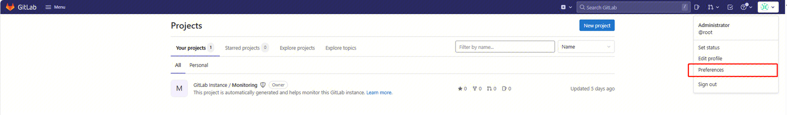

#### （2）选择Application模块
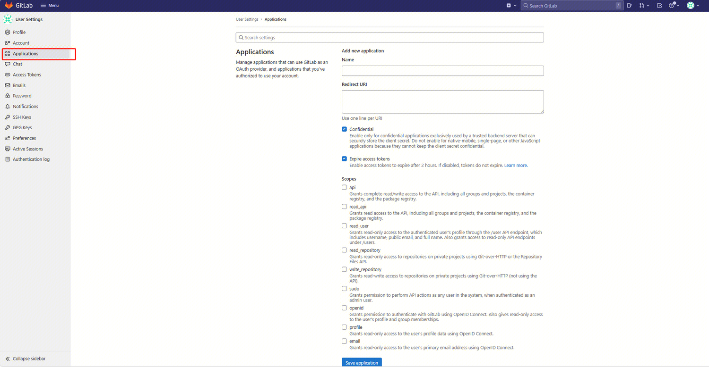


#### （3）添加新的application
填写重定向url，“http://<部署gitlab的ip地址>/cb_git_auth/gitlab”

scopes尽量都勾选，以开启对私有化代码库的访问权限
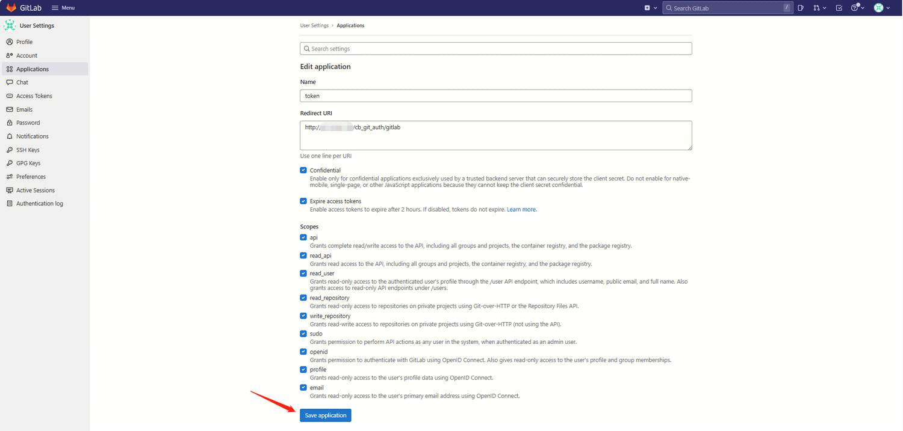

保存application
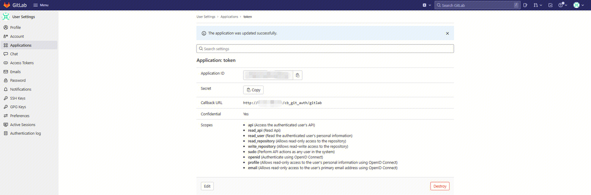
这里的Application ID、Secret 和 Callback URL 之后需要填写到代码分析服务中。

### 2、在项目配置文件中添加相关配置信息
以下三种部署方式选择其中一项即可。
#### （1）docker-compose 部署方式
找到server/dockerconfs/ 目录下的 .env.local 文件，添加配置信息。
```bash
#Oauth认证相关配置
GITLAB_OAUTH_URL="http://<部署gitlab的ip地址>:<gitlab 端口号>/oauth/authorize/"
GITLAB_URL="http://<部署gitlab的ip地址>:<gitlab 端口号>/"
```
在项目根目录下执行更新部署操作
```bash
bash ./quick_install.sh docker-compose stop  #停止运行中的TCA容器
bash ./quick_install.sh docker-compose deploy  #重新部署TCA相关容器与初始化（或刷新数据）
```

#### （2）docker 部署方式
在/.docker_temp/configs/config.sh 中添加以下配置 （首次部署无该文件夹）
```bash
#Oauth认证相关配置
export GITLAB_OAUTH_URL="http://<部署gitlab的ip地址>:<gitlab 端口号>/oauth/authorize/"
export GITLAB_URL="http://<部署gitlab的ip地址>:<gitlab 端口号>/"
```
在项目根目录下执行更新部署操作
```bash
bash ./quick_install.sh docker deploy
```

#### （3）源代码部署方式
在/scripts/config.sh 中添加以下配置
```bash
#Oauth认证相关配置
export GITLAB_OAUTH_URL="http://<部署gitlab的ip地址>:<gitlab 端口号>/oauth/authorize/"
export GITLAB_URL="http://<部署gitlab的ip地址>:<gitlab 端口号>/"
```
在项目根目录下执行重新启动操作
```bash
bash ./quick_install.sh local start  #启动服务（会自动关闭之前的服务）
```


### 3、代码分析平台添加Oauth配置
#### （1）进入后台管理 
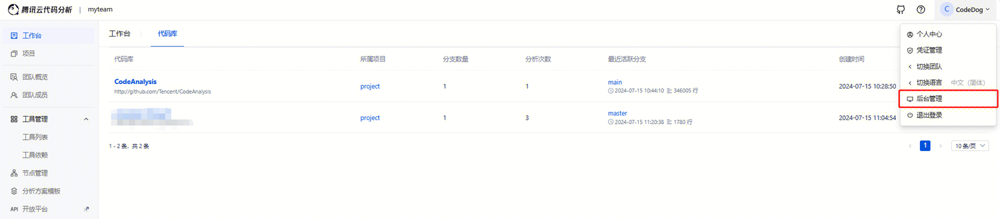

#### （2）进入Oauth管理
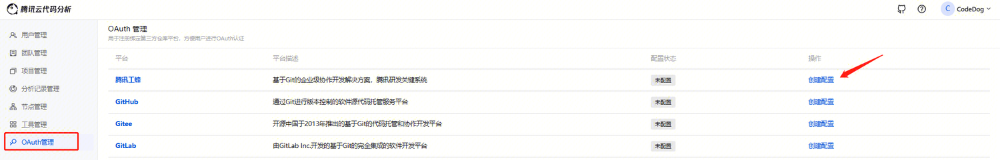

#### （3）创建配置
将application中的Application ID、Secret 和 Callback URL分别填入
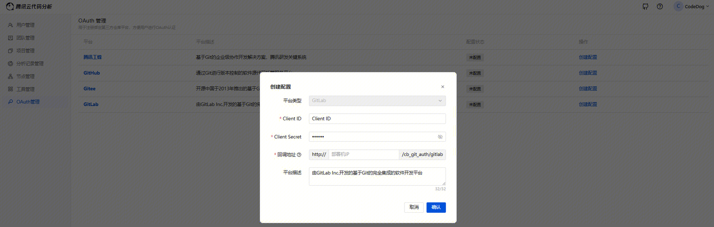

#### （4）前往个人凭证管理，点击认证
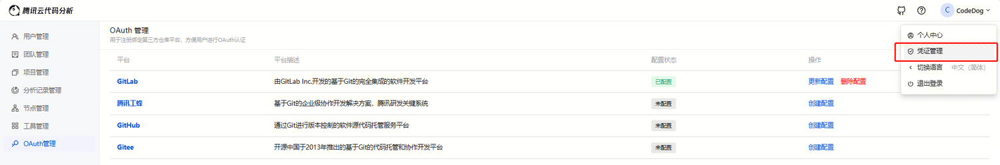
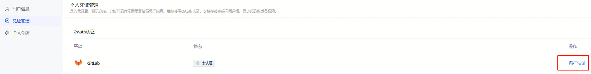

#### （5）弹出私有化gitlab的页面，点击Authorize 进行授权。
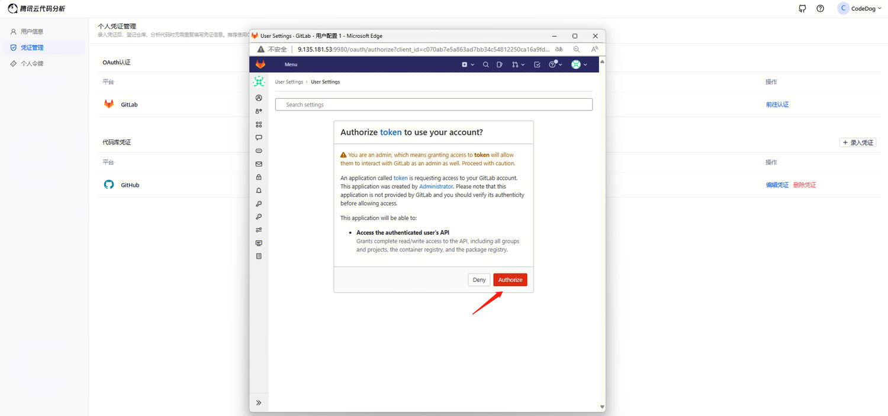
#### （6）授权成功
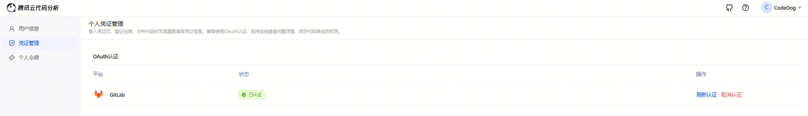


## 三、常见问题
### 1、使用Oauth登录的方式，认证时跳转页面失败
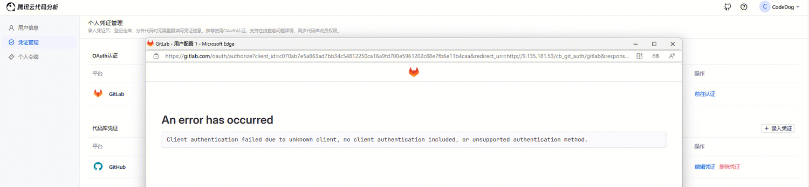
#### 错误详情：
An error has occurred

Client authentication failed due to unknown client, no client authentication included, or unsupported authentication method.
#### 解决方案：

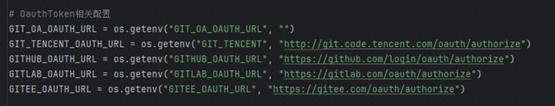

如图，GITLAB_OAUTH_URL没有配置，默认使用 https://gitlab.com/oauth/authorize 。

需要根据项目部署方式，修改配置信息。

（1）docker-compose 部署方式

找到server/dockerconfs/ 目录下的 .env.local 文件，添加配置信息
```bash
GITLAB_OAUTH_URL="http://<部署gitlab的ip地址>:<gitlab 端口号>/oauth/authorize/"
```
（2）docker 部署方式

在/.docker_temp/configs/config.sh 中添加以下配置 （首次部署无该文件夹）
```bash
export GITLAB_OAUTH_URL="http://<部署gitlab的ip地址>:<gitlab 端口号>/oauth/authorize/"
```
（3）源代码部署方式

在/scripts/config.sh 中添加以下配置
```bash
export GITLAB_OAUTH_URL="http://<部署gitlab的ip地址>:<gitlab 端口号>/oauth/authorize/"
```


### 2、无法找到本地部署的服务对应的前端页面
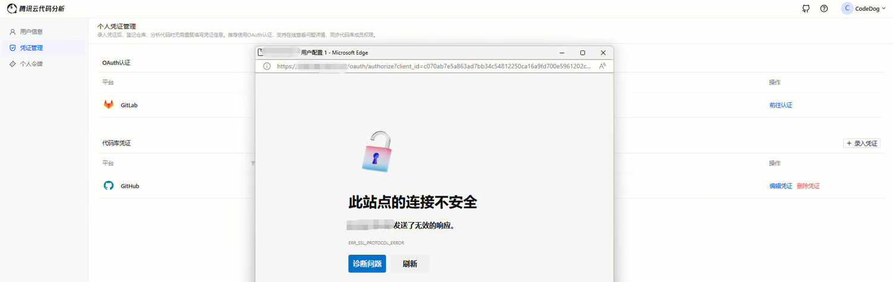
#### 错误详情：
此站点的连接不安全，发送了无效的响应。

ERR_SSL_PROTOCOL_ERROR
#### 解决方案：
配置的url存在问题，可能使用了https协议，访问本地ip不能用https协议，修改成http。

### 3、认证没有跳转到正确的页面，或直接跳回到代码分析平台登陆界面。
#### 解决方案：
（1）检查配置url是否加端口号，默认80端口可能已经被占用，或已经分配给代码分析平台。
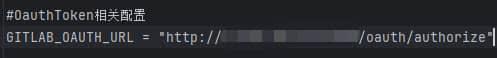

（2）检查回调地址是否填写端口号
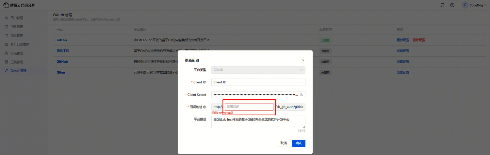

### 4、OAuth授权失败
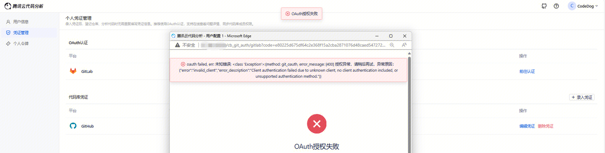
#### 错误详情：
oauth failed, err: 未知错误: <class 'Exception'>:{method: git_oauth, error_message: [400] 授权异常，请稍后再试，异常原因：{"error":"invalid_client","error_description":"Client authentication failed due to unknown client, no client authentication included, or unsupported authentication method."}}
#### 解决方案：
client.py 中存在默认的GITLAB_URL，如果在配置文件中没有设置GITLAB_URL，那么TCA将默认访问https://gitlab.com
```bash
GITLAB_URL = os.environ.get("GITLAB_URL") or "https://gitlab.com"
```
客户端调用的API都需要使用到GITLAB_URL作为前缀的路径，会发送post请求到 https://gitlab.com 路径下，因此需要对路径进行修改。

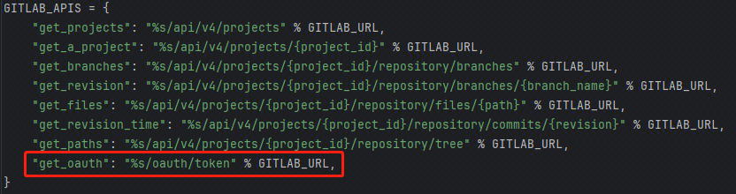

要连接私有化的gitlab，需要根据项目部署方式，修改配置信息。

（1）docker-compose 部署方式

找到server/dockerconfs/ 目录下的 .env.local 文件，添加配置信息
```bash
GITLAB_URL="http://<部署gitlab的ip地址>:<gitlab 端口号>/"
```
（2）docker 部署方式

在/.docker_temp/configs/config.sh 中添加以下配置 （首次部署无该文件夹）
```bash
export GITLAB_URL="http://<部署gitlab的ip地址>:<gitlab 端口号>/"
```
（3）源代码部署方式

在/scripts/config.sh 中添加以下配置
```bash
export GITLAB_URL="http://<部署gitlab的ip地址>:<gitlab 端口号>/"
```


