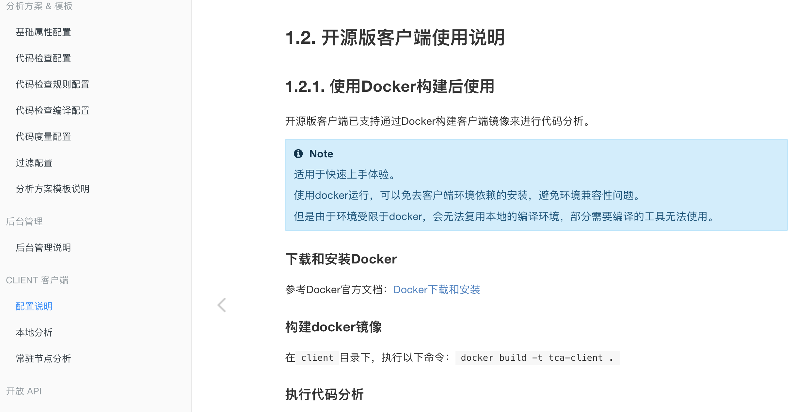
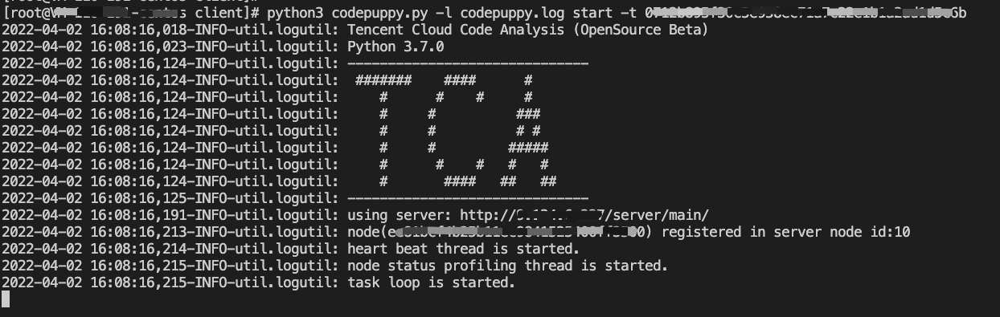
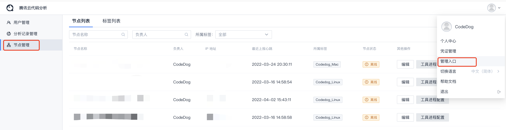
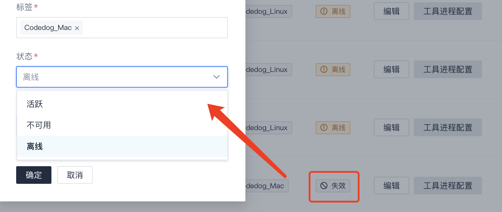
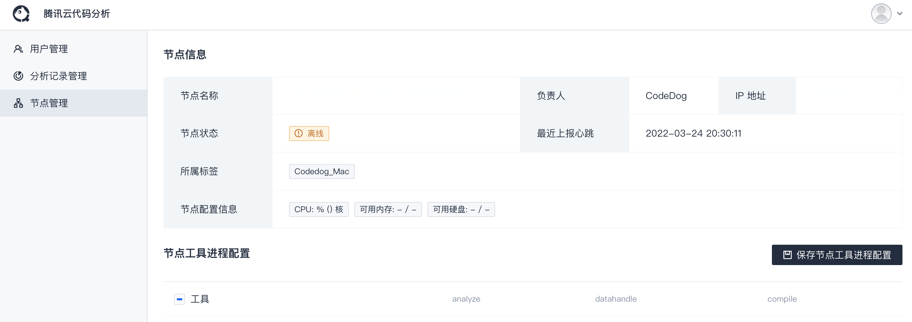

# 适用场景

- 以往的单机器单进程，性能比较低，工具排队等待时间过长。希望通过并行执行分析来提高分析效率。

- 希望尽量使用公共资源或使用专机资源。

**为了满足以上需求，TCA已经进行如下支持：**

- 支持工具在多台机器上并行执行。
- 支持指定工具在指定的机器上运行。
- 支持与本地启动的任务衔接，加速本地任务扫描。
- 配套任务状态监控能力，及时重置初始化超时或机器掉线的任务。
> TCA客户端除了通过localscan命令启动单次的代码分析，也可以作为一个分布式分析节点启动，作为常驻进程，多个节点可以分布式并行执行服务端下发的任务，提高扫描效率。和本地分析一样，需要先安装环境和必要的工具，并配置好服务端地址。
 
# 使用手册—常驻节点配置
**前置步骤**
公共/专有机器上具备客户端。
开源版客户端，需要配置相关环境和依赖，可查阅帮助文档中的开源版客户端使用说明（如下图）

  
  （界面右上角图标点击-帮助文档-Client 客户端）

**1.配置 config.ini 文件**

将`<Server IP地址>`替换成实际的serve ip（可包含端口号）。

**2.启动代码分析常驻节点**
 
1. 从TCA前端页面中获取 `token`，前往 个人中心-个人令牌-复制`Token` 。
   - **作为公共节点**：`token`需要具有超级管理员权限（界面右上角图标点-管理入口-用户管理），如使用CodeDog账户的`token`。

   - **作为专机节点**：该节点仅能分析该token具有权限的项目。
  
2. 进入到client目录下，执行命令：
 `python3 codepuppy.py -l codepuppy.log start -t <token>` 

  

3. 启动后，可以在命令行输出或codepuppy.log中查看运行日志，如果未报异常，且输出`task loop is started.`，表示节点已经正常启动。

**3.配置节点**
> 常驻节点首次启动后，需要到节点管理页面设置节点状态（默认为不可用），将其设置为活跃，用于接收和执行任务。

1. 进入TCA节点管理页面。可以看到当前在线的节点，可以修改节点名称、标签、负责人等信息。

 
 （界面右上角图标点击-管理入口-节点管理）
 * 常驻节点首次启动后，需将节点状态从不可用（失效）状态切换到活跃（在线）状态。

 

 - 可以进入工具进程配置页面，对节点支持的工具进程进行管理（默认会全部勾选），未勾选的工具进程，将不会在该节点上执行。

 

 - 节点所属标签会与分析方案中的运行环境标签进行匹配，只有相同标签的任务才会下发到该机器节点上。

本功能代码已提交开源版，欢迎使用！ :+1: