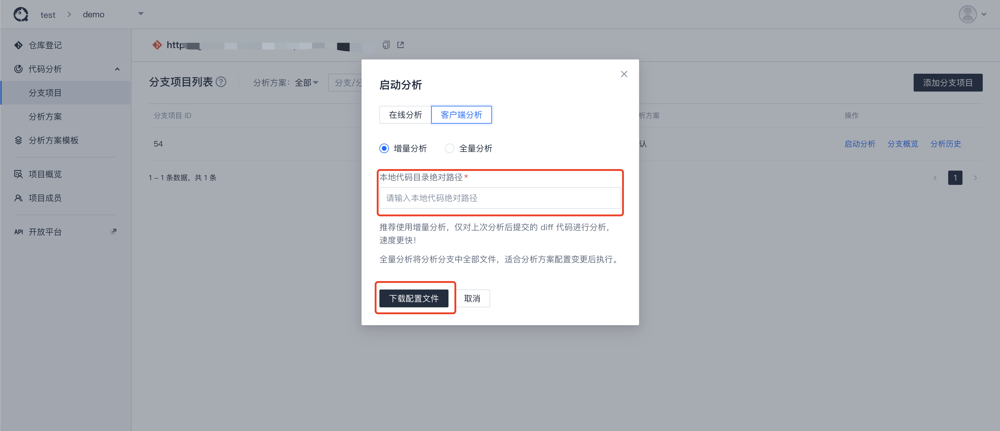

# 启动代码分析

在完成 Server、Web 和 Client 相关部署和配置后，可通过平台执行代码分析。

## 执行代码分析

初始化创建项目后，可通过 `在线分析` 或 `客户端分析` 来启动代码分析。

## 在线分析

在线分析即是通过Server端将分析任务注册到执行队列中，并将任务分配到平台配置的常驻节点上，在常驻节点执行分析，分析完毕后将分析结果上报入库。

::: tip
平台需要存在常驻节点，请查阅 [常驻节点分析](../guide/客户端/常驻节点分析.md)

否则任务因没有机器而无法完成分配，超时后任务会注销。
:::

## 客户端分析

客户端分析即是本地分析，可直接配置本地的客户端配置文件，或在平台上配置好对应信息后，下载配置文件，替换客户端配置问题，并启动客户端分析。分析完毕后会将数据上报入库。

- 下载配置文件

  

- 替换客户端配置文件，并启动客户端分析。

::: tip
本地需要下载客户端，请查阅

- [部署与配置客户端](./deployClient.md)
- [客户端使用说明文档](../guide/客户端/本地分析.md)
:::

## 查看分析历史

分析结束后，数据会上报到服务端。可进入分析历史页面查看分析记录以及分析结果。

## 查看分析概览

分析结束后，进入分支概览可以查看该分支指定分析方案的概览数据以及 [问题列表](../guide/代码检查/分析结果查看.md) 等。

