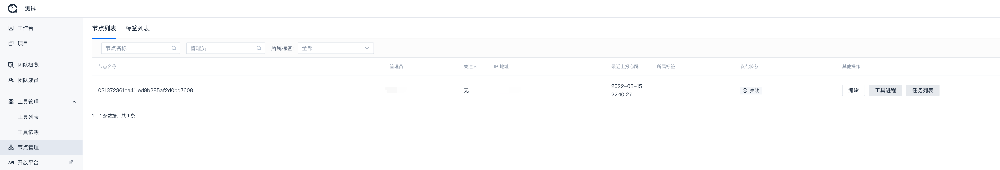
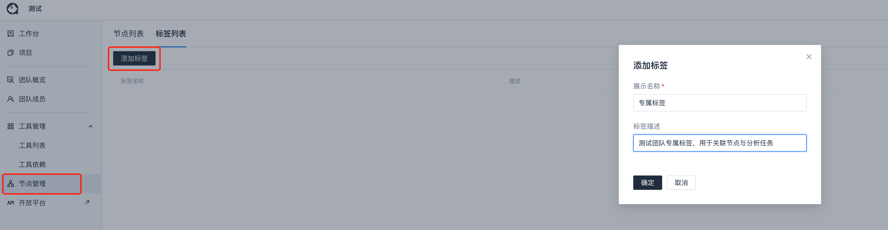

# 节点与标签

除了使用**公共节点**执行代码分析外，团队还可以利用**团队标签**注册并使用**团队节点**。

## 名词释义与特点

- 团队节点是**团队注册并管理**的**私有**节点。

- 团队节点**仅会运行**当前团队所属的分析任务。

- 团队标签是用于关联节点机器与分析项目。
  ::: tip
  当一个分析项目在方案中配置运行环境为团队标签后，该项目创建的任务就会下发到团队标签关联的节点机器上运行
  :::

## 适用场景

1. 业务项目**不想**在公共机器上**排队**等待

2. 业务项目**代码比较敏感**，不能在公共机器上运行

3. 业务项目需要**依赖特定**的**机器环境**（比如CPU架构、操作系统等）

4. ...

以上场景，均可考虑使用团队节点，业务团队提供机器资源接入作为团队节点，仅分析自己业务的代码库，**保证执行效率**，**保护源码不泄漏**，**支持项目特殊依赖**等

## 团队节点注册

- 根据环境下载客户端二进制文件或拉取源码，参考[客户端](../客户端/配置说明.md)。

- 通过终端启动客户端：

  - 客户端二进制启动

    ```bash
    ./codepuppy start -t TOKEN --org-sid ORG_SID
    ```

  - 客户端源码启动

    ```bash
    python3 codepuppy.py start -t TOKEN --org-sid ORG_SID
    ```
  
  ::: tip
  1. TOKEN 可以从平台**个人中心-个人令牌**页面获取
  2. ORG_SID 可以从**页面链接**中获取
  :::

## 团队节点管理

完成团队节点注册后，可以在当前团队下看到对应的节点信息，同时**需要进行配置**

::: warning
- 团队节点**首次注册**时，需要手动在平台上配置**所属标签**、**节点可用性**、**工具进程**等。
- 将节点的**节点可用性**调整为**活跃**后，运行客户端节点的终端会输出**心跳上报成功**的日志
:::

- 首次注册团队节点，节点状态为不可用

  

- 调整后的节点
  
  

- 配置节点关联的工具进程：
  
  

::: tip
1. 团队节点使用的**所属标签**均为当前团队内创建的标签，可参见[团队标签管理](#团队标签管理)
2. 团队标签可以参考`CodeDog`标签为不同的系统类型（Linux、MacOS、Windows）建立标签，比如`专属标签-Linux`、`专属标签-Mac`等
:::

### 团队节点执行任务范围

::: warning 使用团队节点运行分析任务的前提
对应分析项目使用的分析方案中，需要配置分析方案中的**运行环境**为该团队节点配置的所属标签。
:::

::: warning 团队节点执行的任务范围取决于该节点的负责人
- 如果节点负责人为团队管理员，该节点可以执行当前团队所有项目的分析任务
- 如果节点负责人为项目管理员，该节点只能运行指定项目下的分析任务
- 如果节点负责人为部分代码库的管理员，该节点只能运行对应代码库的分析任务
:::


## 团队标签管理

您可以创建一个团队标签，并配置到您的团队节点和您的分析方案中

- 创建团队标签。

  

- 配置团队节点所属标签。
  
  

- 配置分析方案运行环境。

  

