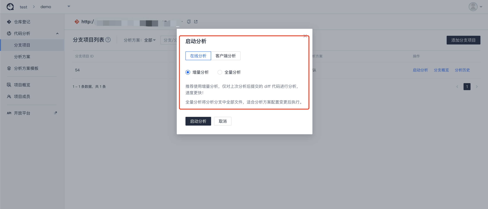

# 启动代码分析

在完成 Server、Web 和 Client 相关部署和配置后，可通过平台执行代码分析。

## 执行代码分析

初始化创建项目后，可通过 `在线分析` 或 `客户端分析` 来启动代码分析。

注：  
- TCA推荐使用`在线分析`，您可根据具体使用场景选择其一。
- `在线分析`表示配置代码库链接后，TCA客户端拉取代码后进行分析；`客户端分析`在配置本地待扫描代码路径后，无需代码拉取直接分析本地代码。  
- `在线分析`与`客户端分析`具体详情及配置参考[TCA客户端配置详情](../guide/客户端/客户端配置详情.md)

## 查看分析历史

分析结束后，数据会上报到服务端。可进入分析历史页面查看分析记录以及分析结果。

## 查看分析概览

分析结束后，进入分支概览可以查看该分支指定分析方案的概览数据以及 [问题列表](../guide/代码检查/分析结果查看.md) 等。

