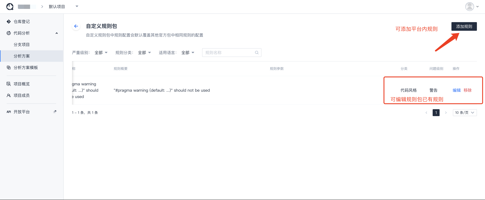

# 代码检查-规则配置

在上一节文档**代码检查配置**中我们大致已经了解规则配置主要由**官方规则包**和**自定义规则包**构成，本节将详细描述规则配置。

**官方规则包**是由腾讯云代码分析平台经过多年深耕，在业务中不断实践整理而出的规则集合包，然而平台有超过**10000+**的规则，有些规则并未放到官方规则包中，甚至有些规则是由用户自定义的规则。此外，有些官方规则包中的规则，对于不同的团队所需可能存在差异，因此产生了如下几种问题：

- **在规则配置中，如何添加规则？**

- **在规则配置中，如果将官方规则包中的规则进行调整？**

## 在规则配置中，如何添加规则？

添加规则存在**两种入口**：

> [!TIP|style:flat]
> 无论何种，最终都是将规则添加到自定义规则包中

- 用户可直接点击页面中的添加规则

  

- 用户可点击自定义规则，进入自定义规则包后，再点击添加规则

  

  

在添加规则过程中，可以单选或者批量多选规则，可以根据搜索栏进行多维度查询规则

## 在规则配置中，如果将官方规则包中的规则进行调整？

用户可以点击进入官方规则包，进入官方规则包中，对已存在的规则进行编辑。

> [!WARNING|style:flat]
> 在官方规则包中对规则的任意操作，实质上是将对应规则增加到自定义规则包中进行了相关操作。
>
> 自定义规则包中的规则配置会默认覆盖其他官方包中相同规则的配置。

